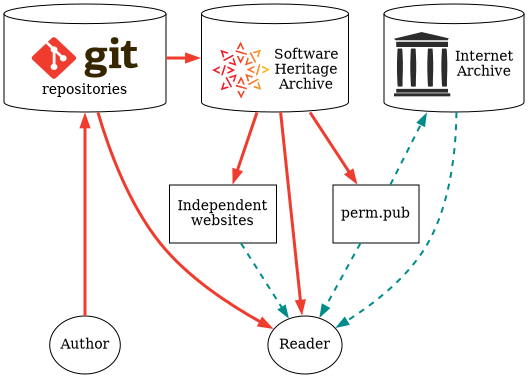

# Baseprints

Digital research documents disseminated across many channels.

**Legend:**

To learn more, you can read this document (itself a baseprint):

[What is a baseprint?](https://perm.pub/H5NOlCVM9P5Vv4LbeuwJsaME8kM)

or try creating your own baseprint.

[Author a baseprint](author.md){ .md-button .md-button--primary }

## Reading baseprints

There are several ways to access an archived baseprint:

* Run software to retrieve a baseprint from a git repository.
* Run software to retrieve a baseprint from the [Software Heritage
 Archive](https://archive.softwareheritage.org/).
* Browse to a baseprint indexed by [perm.pub](https://perm.pub).
* Browse to an independent website that presents a baseprint as HTML and/or PDF.
* Browse to a baseprint that has been archived at the [Internet Archive](https://web.archive.org).

The easiest way for readers is to visit [perm.pub](https://perm.pub/) or an independent
website that serves HTML and PDF presentations of baseprints.
For example, one way to read the document "What is a baseprint?" is to
browse to the URL:

[https://perm.pub/H5NOlCVM9P5Vv4LbeuwJsaME8kM](https://perm.pub/H5NOlCVM9P5Vv4LbeuwJsaME8kM)

An application that you can run on your own computer to read archived baseprints is
currently being developed.
An open-source software utility and library that can convert a baseprint into a webpage
and PDF file is [epijats](https://gitlab.com/perm.pub/epijats).

## Related technologies

* [JATS4R](https://jats4r.org/)
* [PMC Open Access Subset packages](https://www.ncbi.nlm.nih.gov/pmc/tools/openftlist/)
* [Software Heritage Archive](https://www.softwareheritage.org/)
* [SWHIDs : SoftWare Hash Identifiers](https://www.swhid.org/)
* [Digital Succession Identifiers](https://perm.pub/ji2STto1mZ3i2BmnGxbkebejKH4)
